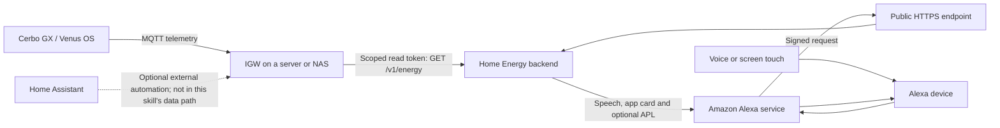
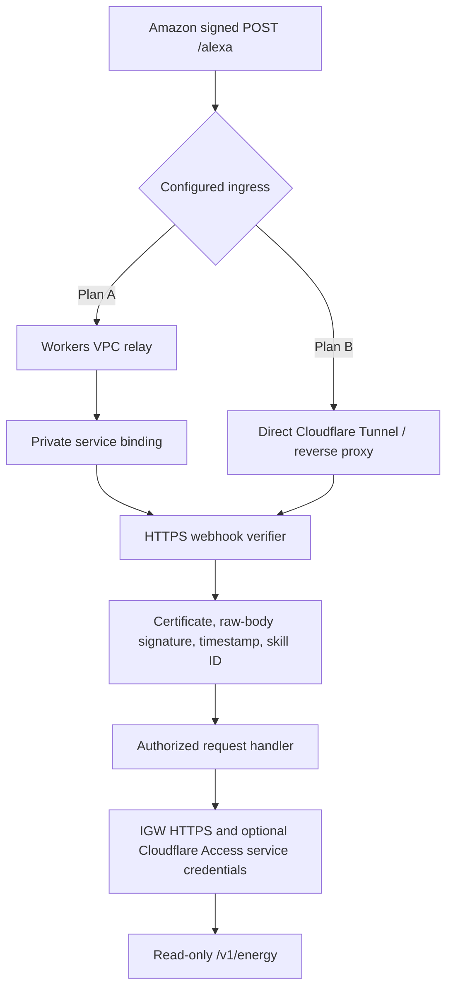
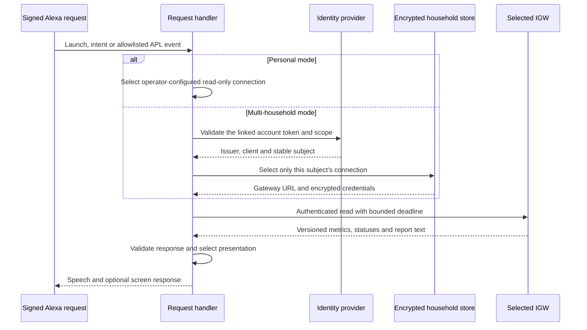
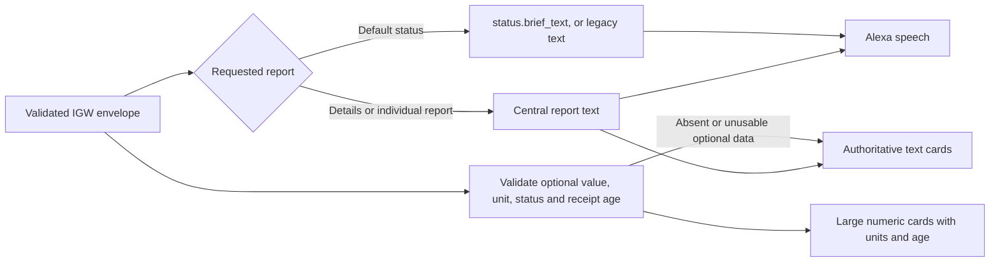
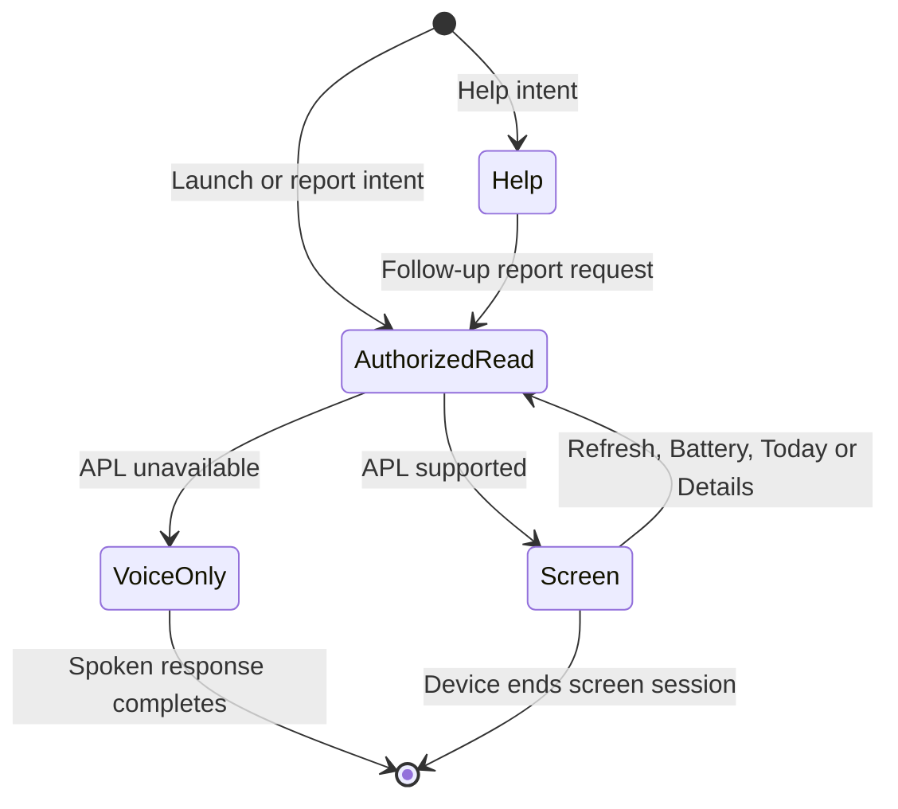

# Home Energy architecture

This document describes the implemented read-only Alexa adapter. Deployment
examples use placeholders. Source releases, a deployed backend, Amazon skill
configuration, account linking and physical device acceptance are separate gates.

## Responsibilities and trust boundaries

Cerbo publishes measurements. IGW selects sources, validates freshness and
topology, normalizes units and produces English reports. The adapter validates
the response and presents it. It has no MQTT credentials, inverter command
token, history database or battery forecast model. Voice requests do not create
additional telemetry polling on Cerbo.

## Public ingress and outbound access

The public Alexa route cannot require a browser login or the IGW service token.
The relay preserves the bytes Amazon signed. Backend verification remains active
on every route. Outbound gateway credentials stay on the backend; they are not
sent to Alexa devices or included in APL documents. Plan B requires independent
verification of applicable Cloudflare security rules. See the
[deployment alternatives](README.md#cloudflare-deployment-plan-a-and-plan-b).

## Personal and multi-household authorization

Missing linking or household setup produces setup instructions. There is no
fallback to another home's connection. Touch, repeat and details use the same
authorization path as voice requests. Public-mode gateway connections retain
their SSRF, redirect and destination validation protections.

## Brief speech and readable screens

IGW owns both brief and full wording. The brief response retains alarm and
data-quality explanations; the adapter does not shorten speech by slicing
sentences. Old gateways without `brief_text` retain their existing response.

`generated_at` is envelope generation time. `age_seconds` is the oldest gateway
receipt age among the metric's configured sources. Neither proves the sensor's
physical sampling time. Non-fresh or invalid data never becomes a numeric zero.
Legacy gateways with text-only metric placeholders still produce useful cards.

## Voice and touch interaction

APL controls send allowlisted `UserEvent` arguments. Session attributes retain
only report selection and detail mode, not telemetry or credentials. Repeat
fetches a current report rather than replaying an old reading. Normal screen
responses keep the screen session available without a reprompt or reopening the
microphone; voice-only responses end the session. Screen lifetime and touch
behavior must be checked on the actual device. This is not a pinned dashboard.

The optional flow intent reads IGW's `reports.flow`. Its signed watts mean grid
import/export and battery charging/discharging. Configured AC consumption does
not imply every electrical load in a home is measured. Missing flow configuration
gets a setup explanation; it does not break the original five reports.

## Reliability, verification and rollback

Gateway reads have a total time budget and at most one retry for classified
transient transport/upstream failures. Authentication, redirect, contract and
freshness errors are not disguised as transient success. There is no cache of
old successful responses. Diagnostics use fixed categories without credentials,
URLs, household values or spoken report text.

Validate unit and real verifier tests, household isolation, payload limits and
portrait/landscape rendering before deployment. Then test Amazon's signed route
and the actual device separately, including stale data, expired linking and
touch after session expiry. The source test suite cannot establish those live gates.

Upgrade IGW first for additive brief/flow fields, then the adapter and Amazon
interaction model. Preserve the native `home energy` invocation and personal
routine. Retain the previous backend image and model for rollback; reverting the
adapter does not require deleting accounts, replacing IGW or changing Cerbo.

See [account linking](docs/account-linking.md), [installation](README.md), and
the [IGW energy contract](https://github.com/victron-venus/inverter-gateway/blob/main/docs/energy-api.md).
